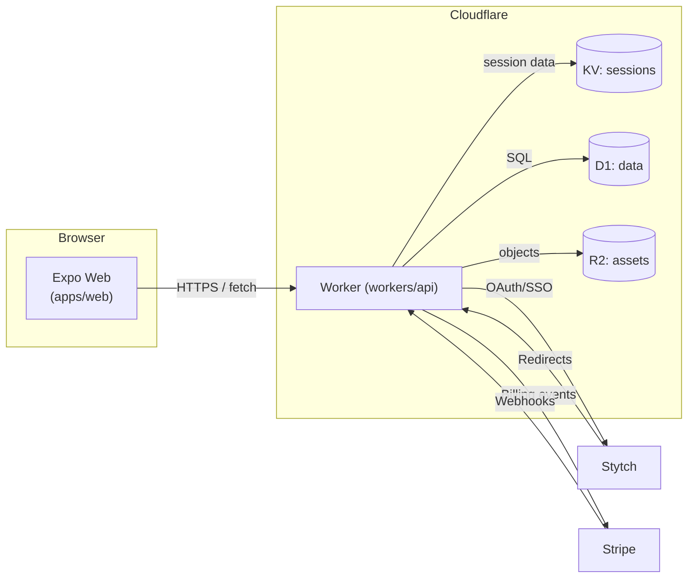

# Architecture Overview

## Components

- **Expo web app (`apps/web`)**: Boots quickly via `expo-router`, rendering placeholder screens that redirect to the Worker endpoints. The shared UI package (`packages/ui`) houses reusable React Native primitives.
- **Cloudflare Worker (`workers/api`)**: Handles landing pages, SSO callback flow, authenticated app shell, Stripe product metadata, and verifies Stripe webhooks via HMAC signatures. Session state is stored in a KV namespace, while durable records (users, subscriptions, projects, audit logs) live in Cloudflare D1. R2 is reserved for future asset uploads.
- **Automation (`bootstrap.sh`)**: Creates and links Cloudflare and Stripe resources from declarative `.env` values, then templates `wrangler.toml` so deployments stay reproducible.

## Request Flow Summary

1. A visitor hits `https://{project_id}.justevery.com`. Cloudflare routes traffic to the Worker, which serves a marketing landing page.
2. When the visitor selects **Sign in**, the Worker redirects to Stytch’s hosted login (`https://login.justevery.com`).
3. Stytch calls back to `/auth/callback` with a session token. The Worker validates the token, stores session metadata in KV, and sets an HttpOnly cookie before redirecting to `/app`.
4. Authenticated requests for `/app`, `/api/session`, or `/payments` read from KV and, when implemented, D1 to hydrate personalised views.
5. Stripe product metadata is currently sourced from environment configuration via `/api/stripe/products`; the webhook `/webhook/stripe` validates Stripe signatures before emitting billing events for later processing.

## Data Storage

- **D1**: Normalised tables for `users`, `sessions`, `projects`, `subscriptions`, and `audit_log` with starter indices.
- **KV**: Stores expiring session records keyed by the Worker-issued session ID.
- **R2**: Placeholder bucket for marketing and user-generated assets. Upload/download endpoints will be added later.

## Deployment

- Local development uses `wrangler dev` for the Worker and `expo start --web` for the client.
- GitHub Actions workflow (`.github/workflows/deploy.yml`) type-checks, tests, and deploys the Worker via Wrangler when credentials are provided.
- `bootstrap.sh` writes `.env.local.generated` to record resource identifiers, making it easy to promote to production or replicate environments.
